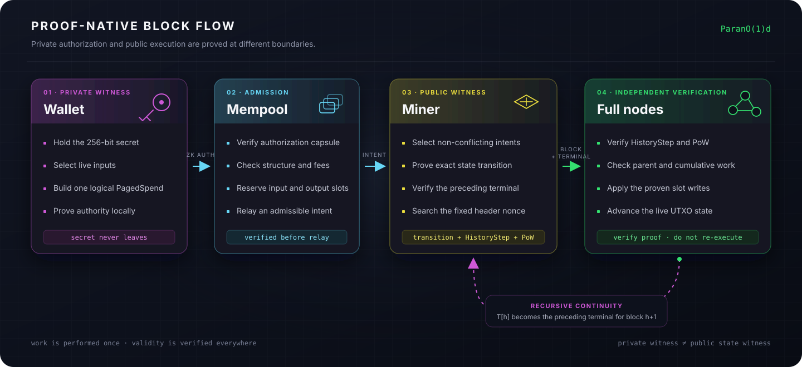

# Architecture

Parano1d moves each proof obligation to the place where its witness already
exists. The wallet knows the spending secret. The miner has the public State
witness. Full nodes need neither: they verify the resulting proofs and
materialize the proven writes.

## The proof boundary

The wallet and miner prove different statements.

The wallet proves knowledge of the 256-bit secret behind every input owner and
binds that authorization to the complete logical transaction. It does not
prove that an input is currently unspent because it does not need a current
Merkle path.

The miner proves the public execution statement: inputs exist, output slots are
empty, values balance, fees follow consensus, the slot writes are exact and the
resulting UTXO root is correct. It also verifies the preceding `HistoryStep`
terminal inside the new proof.

This separation keeps private authorization local while allowing the public
State witness to change between transaction construction and block inclusion.

| Stage | Receives | Establishes |
|---|---|---|
| Wallet | Secret and owned UTXOs | One randomized authorization bound to the logical transaction |
| Mempool | `PagedSpend` intent | Capsule, structure, limits, fees and reservations are admissible |
| Miner | Accepted intents and Live State | Exact State transition and recursive continuity |
| Full node | Block and terminal | `HistoryStep`, PoW and canonical parent are valid |

## Transaction and block flow

1. The wallet selects live UTXOs and builds one logical `PagedSpend`.
2. It constructs a fresh authorization capsule for
   `{logical_txid, input_owner}`.
3. The mempool verifies the complete intent before storing or relaying it.
4. A miner selects non-conflicting intents and computes the exact slot writes.
5. The miner proves the block relation and preceding terminal, then searches
   the fixed Poseidon2b header nonce.
6. Peers verify the atomic `{block, terminal}` bundle and apply its proven
   writes to MDBX.

No peer re-runs wallet proving or miner execution. Invalid authorization cannot
be repaired by a miner, and hash power cannot make an invalid `HistoryStep`
acceptable.

## Recursive continuity

Conceptually, terminal `T[h]` attests to three things:

- block `h` satisfies the public block relation;
- its post-State root is the exact result of the proven writes;
- terminal `T[h-1]` verifies, and its accumulator is the exact pre-State
  boundary for block `h`.

The next block verifies `T[h]` inside its own relation. The chain therefore
accumulates validity recursively while keeping a fixed terminal shape.
Cumulative work still chooses between valid competing chains; recursion does
not replace proof of work.

## State materialization

Verification produces a set of canonical slot writes. A full node applies
those writes to its exact sparse UTXO vector rather than executing transaction
logic again.

Slots live in `2^16`-entry segments. Empty segments are virtual. Clearing the
last occupied slot removes a segment, while allocating an output reuses an
empty slot before extending State. A fresh `creation_id` prevents an old
reference from becoming valid when the same index is reused.

Nodes retain compact headers for cumulative-work comparison and the latest 42
canonical block bodies for ordinary synchronization and shallow reorgs. Older
transaction bodies are not required by active consensus. Payment receipts
preserve independently verifiable inclusion evidence after a body leaves that
window.

## Joining the network

A short gap is filled with retained block bodies and one verified recursive
terminal at the suffix tip. For a deeper gap, the joining node stages headers
and an authenticated snapshot of Live State. It verifies the cumulative-work
chain, the finalized boundary and the matching boundary terminal before
installing the State, then verifies one terminal for the recent suffix tip and
applies its linked bodies.

The snapshot is not trusted State. It is a transport for State whose root and
history boundary are authenticated by consensus.

## Mining boundary

The miner proves all nonce-independent data first. PoW then searches only the
128-bit nonce of a fixed Poseidon2b header. This gives PoW one job: order valid
State transitions.

An external miner receives an immutable, single-use template and returns only
a nonce. Transaction selection, State transition, proof construction and
block relay remain inside the node. Once issued, the template's payout,
transactions and State root cannot be changed by the external worker.

## Implementation map

| Component | Responsibility |
|---|---|
| `noid_tx` | Logical `PagedSpend`, transaction identifiers and authorization binding |
| `noid_mempool` | Intent admission, conflict reservations and relay policy |
| `noid_miner` | Transaction selection, State witness, block preparation and PoW |
| `noid_recursive` | `HistoryStep` relation, terminal verification and recursion |
| `noid_chain` | Consensus rules, MDBX State, headers, reorgs and snapshots |
| `noid_p2p` | GossipSub relay, discovery and synchronization protocols |
| `noid_node` | Runtime orchestration, wallet integration and shutdown |
| `noid_rpc` | Local node, wallet and external-mining interface |

For deployment rather than implementation details, continue with
[Run a node on Linux](../operate/node.md).
