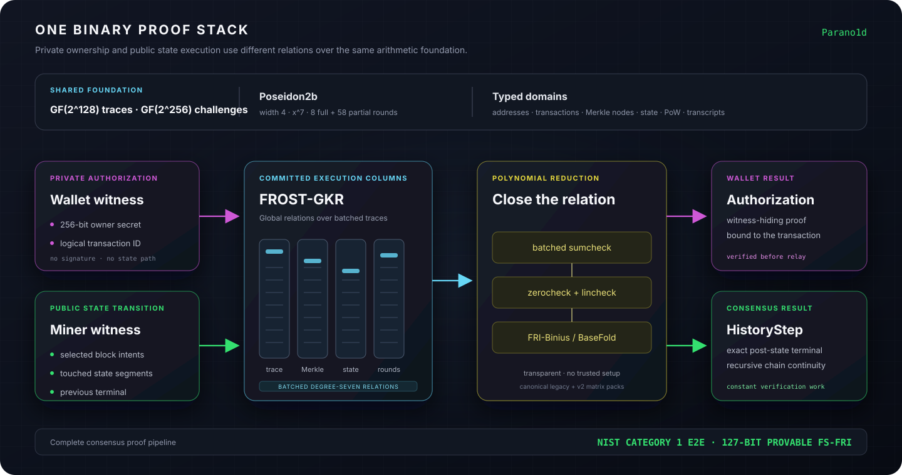

# Proof stack

Parano1d uses one binary arithmetic stack for ownership, State transitions,
Merkle relations, recursive continuity and proof of work commitments. The
committed trace field is the binary tower field `GF(2^128)`. The production
wide-challenge layer uses its quadratic extension `GF(2^256)`.



## Poseidon2b

Poseidon2b is the common permutation:

| Parameter | Value |
|---|---:|
| State width | 4 field elements |
| S-box | `x^7` |
| Full rounds | 8 |
| Partial rounds | 58 |

Typed domain tags separate addresses, physical pages, logical transactions,
Merkle nodes, State commitments, block identifiers, PoW digests and proof
transcripts. Sharing a permutation does not mean sharing a hash domain.

## [FROST-GKR](../research/frost-gkr.md)

The protocol expresses batched Poseidon2b executions and Merkle paths as direct
degree-seven relations over shared Boolean hypercubes. It is the committed-
column reduction used by Parano1d, not a layer-by-layer replay of a circuit.

The reduction keeps the multilinear-extension and sumcheck machinery of GKR
while replacing recursive circuit-layer descent with global relations over
the execution trace. Shared columns let many permutations and paths be checked
without paying for an independent constraint sumcheck for every instance.

## Closing the relation

The downstream pipeline combines:

- batched sumcheck;
- zerocheck;
- lincheck;
- FRI-Binius/BaseFold over the binary field;
- one joint `GF(2^256)` transcript for the three Link and six Block recursive
  regions.

The resulting proof system is transparent: it requires no trusted setup.
The released binaries embed authenticated B25 and B255 matrix packs, including
their expected digests. A build using a different pack cannot silently present
it as the canonical relation.

## Wallet authorization

The wallet proves knowledge of the 256-bit preimage behind `input_owner`,
bound to the logical transaction ID. The proof is freshly randomized and
witness-hiding. It contains no State path.

The serialized authorization has a 92,696-byte worst-case bound. The wire
format permits up to 256 KiB so decoding remains explicitly bounded while
leaving room for the canonical proof object.

## HistoryStep

The block prover establishes the complete public transition and verifies the
previous terminal inside the new relation. The next terminal therefore binds:

```text
previous validity
        +
current block relation
        +
exact post-State
```

Proof size and terminal verification do not grow with chain height. Permanent
headers remain outside recursion for proof-of-work accumulation and fork
choice.

## Security accounting

The production wide-challenge profile uses 65 wallet queries and 133 History
queries. Its current security results are:

| Security statement | Production result |
|---|---:|
| Target FRI security | **128 bits** |
| Provable Block–Tiwari FS-FRI security | **127 bits** |
| Conjectured Block–Tiwari FS-FRI security | **127 bits** |
| Sequential ideal-QROM half-success boundary | **64.707407428576 bits** |
| NIST Post-Quantum Cryptography Category | **Category 1** |
| Dominant Category 1 gate-depth floor | **173.391078499301 bits** |

The Block–Tiwari values measure classical random-oracle FS-FRI expected work.
The Category 1 result concerns the separate end-to-end from-genesis
invalid-State game and is conditional on the fixed Poseidon2b delta, batch
gate-depth price and scalar gate-charge premises stated in the theorem.
Production constants, reductions and exact calculations are in
[`noid_soundness`](https://github.com/ignotusnemo/parano1d/tree/main/noid_soundness).

For claim boundaries and non-proof assumptions, see
[Security model](../protocol/security-model.md). Implementation crates are
mapped in [Workspace](../developers/workspace.md).
