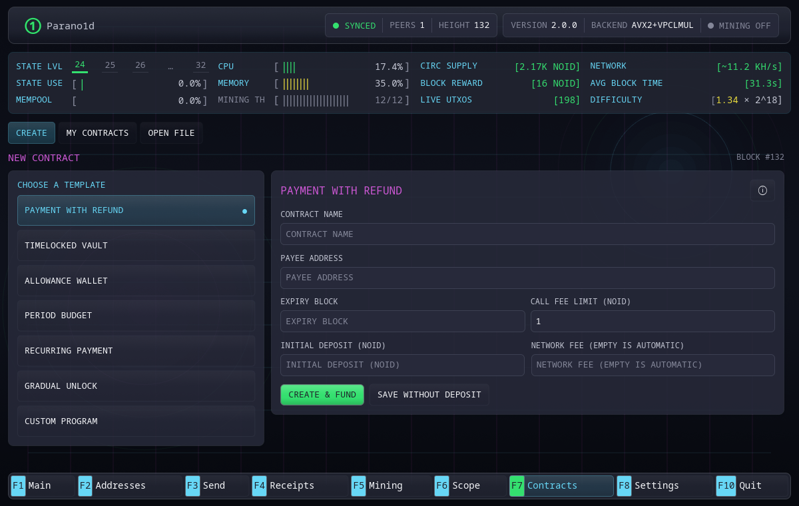
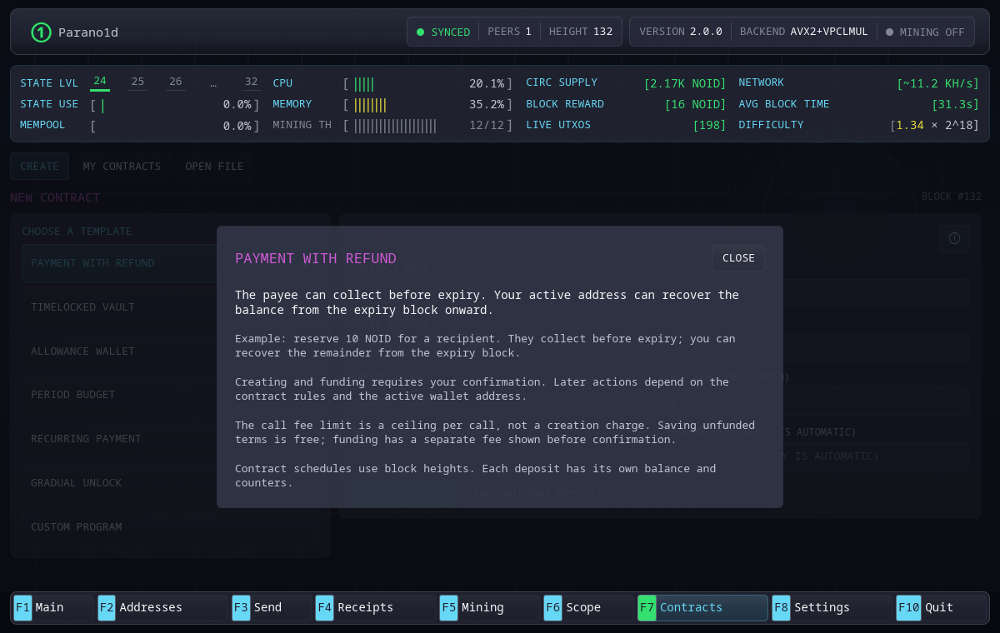
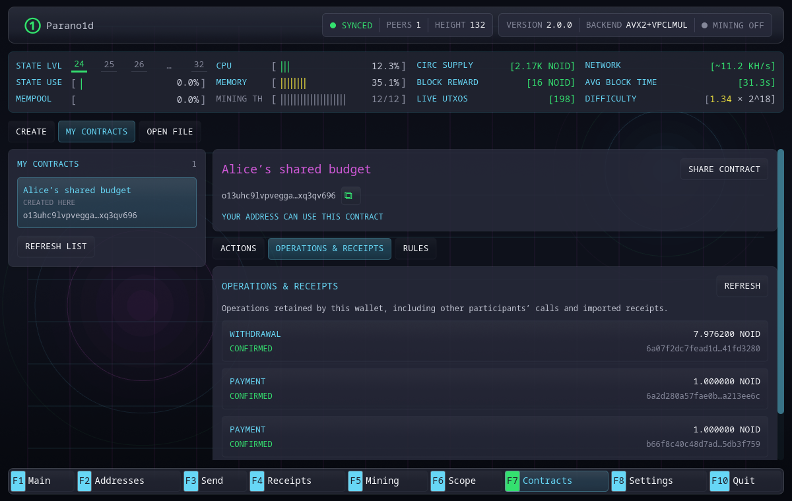
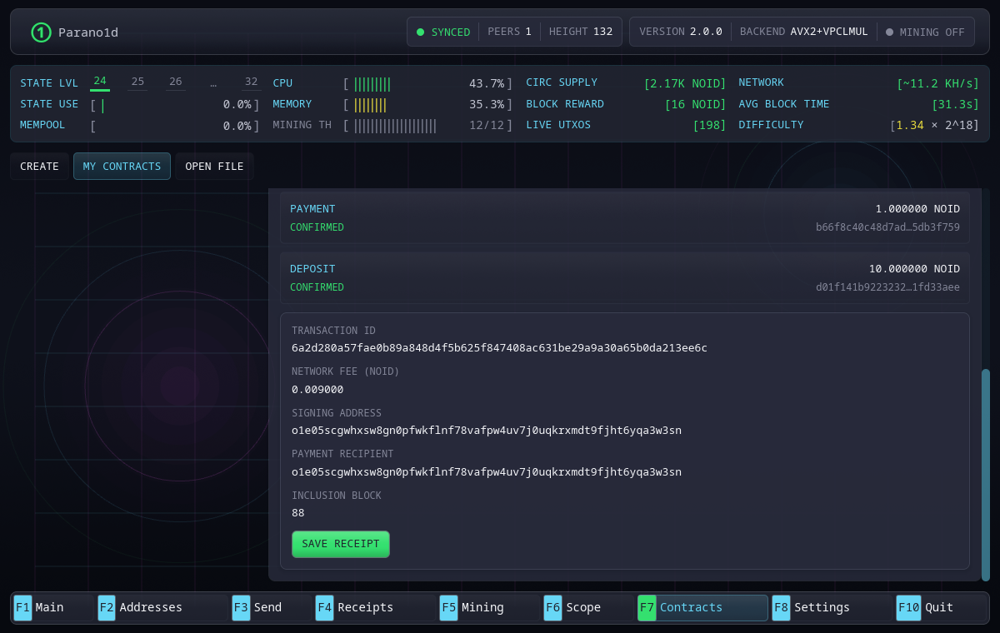
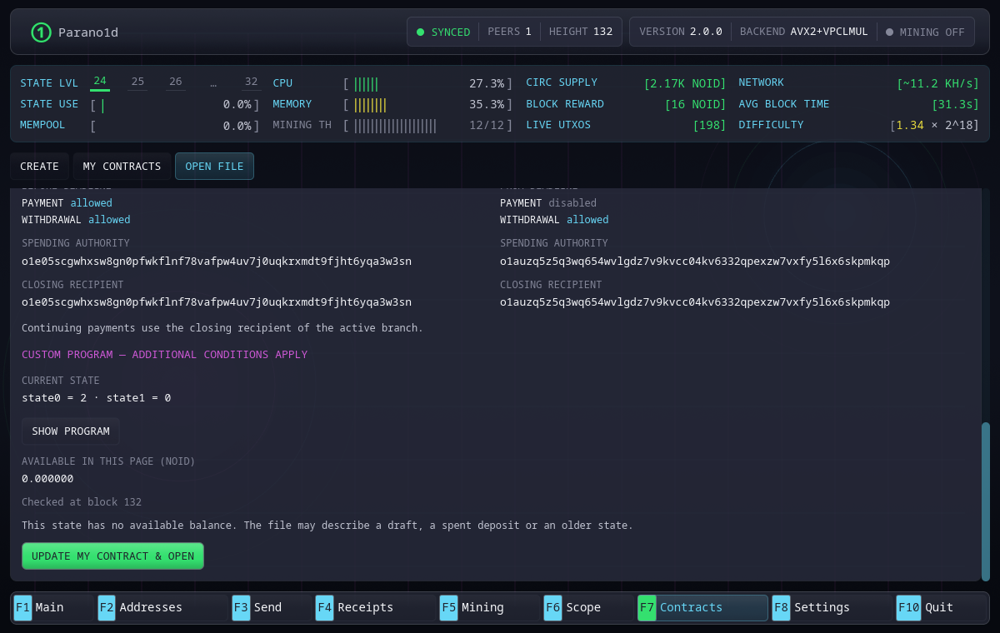

# Contracts in the GUI wallet

Open **F7 Contracts**. Settings are on **F8**. The three top-level tabs divide
the workflow into **Create**, **My contracts** and **Open file**. Screenshots
below show the English GUI on an isolated v2 network; heights, names and
balances are examples, not mainnet measurements.

## Create

Choose one of the six templates or the custom program editor. Use its info
button for an explanation while keeping the form available for the actual
parameters. Enter the parties, amounts and block heights required by that
policy. Review the selected wallet address and the rights each party receives.

Saving creates public terms and a local library entry. It does not deploy a
global account or charge a creation fee. **Call fee limit** is the maximum
network fee permitted by the contract on a later call. It is separate from the
fee for adding funds. The help popup explains this distinction.

## My contracts

Select a contract in the left-hand list. Its name and address stay above the
inner tabs: **Actions**, **Operations & receipts** and **Rules**. Switching
between those tabs preserves the selected contract and form. Rules shows the
program, policy and counters; it is not another creation form.

Actions checks available balances against current verified State. Choose the
funded instance to use. **Add funds** submits an ordinary wallet payment.
Depending on the policy and current authority, the call form can make a
payment, continue without payment or collect by closing. Forms do not override
the contract: a forbidden branch, recipient, amount or height is rejected.

Review the exact fee, recipient, retained balance, branch and successor before
submitting. Submission is pending until inclusion; it is not confirmation.
If the tip or input changes, refresh the review rather than approving stale
terms. A zero balance after another party spends is a current-state result,
not evidence that importing the contract failed.

## Operations and receipts

The journal combines wallet operations with retained verified calls from
**either party**, including received receipts. It shows the actor and payout
recipient separately. It is a local journal, not a global history explorer.
The GUI displays up to 256 recent operations; this display limit does not
delete retained proofs.

Select a confirmed call to inspect its amount, fee and transaction identifier,
then use **Save receipt** to export evidence. Deposits are ordinary payments
and use ordinary payment receipts. A contract call uses a contract receipt.

## Share, open and merge

**Share contract** exports the selected public terms and, when available, one
matching receipt. It does not contain your secret and does not grant authority
that the policy has not already assigned. Send the file to the other party.

In **Open file**, use Browse or enter the path to a shared contract file or
contract receipt. Inspect the parsed terms and verification result. Opening a
preview does not yet add it to the library. For an existing contract,
**Update my contract & open** merges the received evidence; for a new one, add
it to the library. Your own name and saved operations remain.

An older file cannot roll a live contract back. The wallet checks current State
and keeps known related states. A closing receipt still identifies the original
contract even though it has no successor. See [receipts and recovery](receipts-and-recovery.md)
for offline gaps and pruning. **F4 Receipts** remains the ordinary payment
receipt interface; contract files and call receipts belong in **F7 Open file**.

File selection and save dialogs use native platform integration on Linux,
Windows and macOS. The workflow is the same; screenshots show Linux. Keep a
backup of public terms and receipts as well as the wallet secret.
