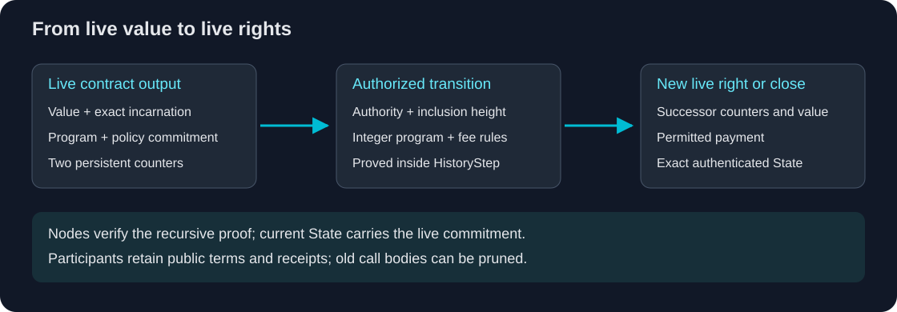

# Proof-native контракты

## From live value to live rights

Живой платёжный выход отвечает на простой вопрос: кто может потратить эту
стоимость? V2 расширяет вопрос: кто вправе получить её, на какой высоте, с каким
лимитом и какие права останутся после операции? Условия входят в
криптографическую идентичность выхода. **Live State может хранить исполнимое
право на стоимость вместе с правилами его следующего допустимого изменения.**

Это архитектурный переход **от live value к live rights**. Возвратный платёж,
делегированный бюджет или постепенная разблокировка становятся текущими
объектами с доказанными переходами. Для проверки их корректности каждому
будущему узлу не требуется хранить и повторно исполнять всю историю приложения.

## Непрерывность переносится доказательством

Публичное раскрытие контракта — opening — содержит программу, правила
расходования, адреса авторизации и текущие счётчики. Poseidon2b связывает эти
данные обязательством. Live State хранит его в поле владельца выхода вместе
с суммой и идентификатором создания; отдельная растущая база состояния
контрактов не добавляется.

Авторизованный вызов расходует именно этот экземпляр выхода. Отношение блока
проверяет opening, ветку срока, авторизацию, целочисленную программу, платёж,
комиссию и полученное обязательство. Продолжающий вызов создаёт преемника;
закрывающий возвращает остаток заданному получателю. `HistoryStep` доказывает
переход вместе с блоком и его рекурсивной предысторией.

Следующий проверяющий аутентифицирует настоящее и его доказательство. Ему не
нужны все предыдущие версии контракта, чтобы установить корректность текущего
выхода. Система слотов по-прежнему удаляет потраченные записи и повторно
использует освободившееся место.

## Общее ядро, пользовательские приложения

Программы используют целочисленный интерпретатор v2, уже доказуемый матрицей
блока. Создание контракта не требует новой схемы, отдельного ключа доказательства
для приложения, разрешительного списка или регистрации в консенсусе. Шесть
шаблонов кошелька — обычные программы и правила, доступные через тот же API,
что и пользовательские условия.

| Живое право | Применение в текущем ядре |
| --- | --- |
| Получение до срока и возврат после него | Возвратные счета и предоплаченные требования |
| Расходование только после высоты разблокировки | Сейфы и отложенный доступ |
| Делегирование ограниченных расходов с восстановлением | Сервисные кошельки и контролируемые операционные средства |
| Общий бюджет последовательных вызовов | Бюджет за период с учётом комиссий |
| Получение фиксированной предоплаты по сроку | Регулярные платежи по инициативе получателя |
| Выдача траншей по привязанному расписанию | Постепенное распределение и разблокировка |

Приложение может добавить собственный интерфейс, уведомления и отправку
авторизованных транзакций. Одни и те же контракты доступны через GUI, CLI и RPC.
Логика приложения не должна превращаться в вечный журнал исполнения,
обязательный для каждого участника сети.

## Ограниченное ядро как основа приложений

ABI 3 содержит два постоянных счётчика `u64`, два временных регистра и шестнадцать
последовательных инструкций с проверяемой арифметикой и условиями. В нём нет
циклов, межконтрактных вызовов, чтения внешних данных и автоматических таймеров.
Платёж по наступившему сроку требует авторизованного вызова. Оба класса
доказательств поддерживают одинаковое ядро; опциональный Large увеличивает
вместимость обычных платежей.

Текущие публичные условия и переносимые чеки остаются полезными данными
приложения. Кошельки локально сохраняют отслеживаемые opening и вызовы. Если
участник пропустил вызов, тело которого уже удалено, ему могут понадобиться
свежие условия или чек от другой стороны. Proof-native проверка убирает
обязательное воспроизведение истории, но не потребность в данных и резервных
копиях приложения.

Это общая основа для приложений с проверяемой передачей стоимости и точными
правами расходования, при которой сеть продолжает аутентифицировать живое
настоящее. Бюджеты инструкций и блоков заданы явно; приложения уже можно
проектировать в их пределах.

Контракты включаются в mainnet на **H210537**. Начните с
[руководства](../contracts/index.md), [жизненного цикла](../contracts/lifecycle.md)
и [целочисленного ядра](../contracts/core.md).
