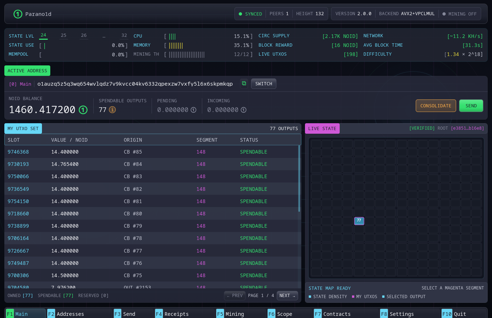

# Кошелёк

Нативный кошелёк работает как приложение с полной нодой. На одном устройстве
он создаёт адреса, доказывает право расходования, отправляет транзакции,
следит за Live State, проверяет блоки и сохраняет платёжные чеки.

Встроенная нода — внутренний компонент приложения. Кошелёк запускает её без
терминала, общается с ней через локальный RPC и корректно останавливает при
выходе.



Снимки заполненных страниц используют встроенный демонстрационный набор.
Адреса, балансы, блоки и идентификаторы транзакций на них приведены только для
иллюстрации.

## Навигация

| Клавиша | Раздел | Назначение |
|---|---|---|
| `F1` | Главная | Активный адрес, балансы, UTXO и карта Live State |
| `F2` | Адреса | Производные адреса и выбор активного владельца |
| `F3` | Отправить | Построение, доказательство и отправка платежа |
| `F4` | Чеки | Сохранённые исходящие чеки и независимая проверка |
| `F5` | Майнинг | Управление встроенным майнером и добытые блоки |
| `F6` | Поиск | Поиск в Live State, блоках и сохранённых транзакциях |
| `F7` | Контракты | Шаблоны, сохранённые контракты и квитанции вызовов |
| `F8` | Настройки | Секрет, нода, сеть и интерфейс |
| `F10` | Выход | Остановка управляемой ноды и закрытие приложения |

`Esc` возвращает из подробного представления и закрывает диалоги.

## Контракты

Контракты доступны с блока активации v2. В **F7** три сценария:

- **Создать**: выберите шаблон или измените свою программу. Кнопка информации
  объясняет правила и показывает пример. **Создать и пополнить** рассчитывает
  комиссию и запрашивает подтверждение; **Сохранить без пополнения** оставляет
  условия для дальнейшего использования.
- **Мои контракты**: откройте сохранённый контракт, проверьте права активного
  адреса, выберите остаток и действие. **Операции и чеки** показывает последние
  локальные операции и позволяет сохранить проверенный чек после подтверждения.
  **Правила** показывает полные условия и программу.
- **Открыть файл**: просмотрите полученный контракт или чек вызова. Узел проверит
  условия, приложенное доказательство и текущие остатки. Добавление в список
  выполняется отдельной кнопкой.

**Передать контракт** сохраняет публичные правила вместе с подходящим
проверенным чеком, если он доступен. Чек подтверждает прошлую операцию;
возможность потратить средства проверяется отдельно. У каждого пополнения
свой остаток и счётчики. Одинаковые условия не объединяют бюджеты пополнений.

Список контрактов и последние операции сохраняются при перезапуске. Узел
хранит отслеживаемые условия и чеки вызовов. Для передачи другому участнику
экспортируйте файл. Сохраняйте `wallet.contracts.json` и каталог
`contract-activity/` вместе с резервной копией кошелька: публичные правила
контракта и сохранённые доказательства нельзя восстановить только из секрета.

## Активный адрес

В каждый момент активен один производный адрес. Он задаёт:

- владельца входов нового платежа;
- адрес возврата сдачи;
- адрес выплаты встроенного майнера по умолчанию.

Кошелёк продолжает сканировать и показывать созданные неактивные адреса, но не
подмешивает их UTXO в платёж от активного адреса.

## Локальное доказательство

После нажатия **Доказать и отправить** форма блокируется, пока кошелёк строит
новую капсулу авторизации. Майнинг уступает локальной операции процессорные
ресурсы. Секрет не попадает в поля транзакции и не покидает процесс кошелька.

После успешной отправки финальная панель показывает логический идентификатор
транзакции и публичные параметры платежа. Нода отслеживает подтверждение, а
затем кошелёк сохраняет чек.

## Локальные данные

Каталог данных по умолчанию:

```text
~/.parano1d/data
```

на Linux и macOS; в Windows используется соответствующий каталог
`.parano1d\data` в профиле пользователя.

Мастер-секрет находится в `wallet.key`, сохранённые чеки — в
`wallet.receipts`, настройки интерфейса — в
`~/.parano1d/gui-settings.json`.

Файл мастер-секрета не зашифрован паролем. Защитите учётную запись
операционной системы и сохраните секрет до получения средств.

Начните с [первого запуска](first-run.md), узнайте, как
[фотография становится ключом кошелька](photo-key.md), или сразу перейдите к
[резервному копированию и восстановлению](backup-recovery.md).
