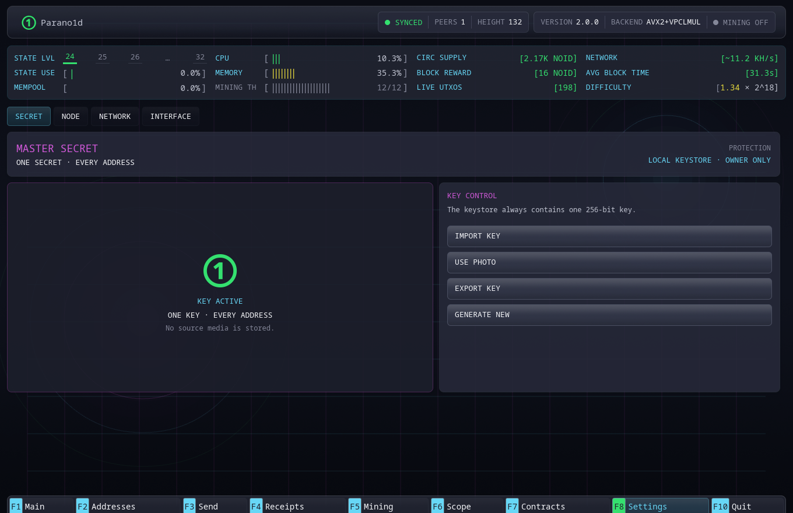

# 设置

按 `F8` 打开设置。

## 密钥

密钥页面显示当前主密钥模式，并提供明确的维护操作：

- 导出当前由 64 个十六进制字符表示的主密钥；
- 导入已有密钥；
- 使用照片像素替换密钥；
- 生成新密钥。

更换密钥会改变全部派生地址。如果当前密钥控制仍需保留的资金，请先导出。

密钥字段不是普通的应用偏好设置。执行相关操作时，钱包会停止私有节点，
以原子方式更新仅所有者可读的密钥文件，再重新初始化钱包。

## 节点

节点设置包括：

- 数据目录；
- 日志级别；
- 更改需要重启的参数后重启节点。

终端风格的日志窗口显示私有节点真实日志的有限尾部。可选择并复制文本用于诊断，
查看日志不会创建第二份永久日志存储。

更改数据目录会让应用切换到另一套数据库和钱包。应用前请确认目标路径。

## 网络

网络设置包括：

- P2P 监听地址；
- 额外的种子端点。

默认 P2P 监听地址为 `0.0.0.0:9600`。无需自定义条目也可使用内置 DNS
发现。

不要把私有 RPC 端点作为网络设置暴露出去。GUI 和节点只在本机通信。
