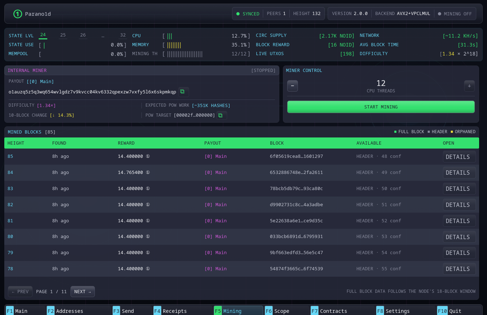

# Internal mining

The Mining page controls the full node's built-in proof and PoW pipeline. Open
it with `F5`.

## Requirements

Mining becomes available when:

- the node is synchronized;
- at least one authenticated peer is connected;
- the active or configured payout address is valid;
- the CPU passes the production hardware check.

The peer requirement prevents accidental mining on an isolated local view.
Peers do not approve the block and cannot weaken local proof validation.

## Controls

Choose the number of logical CPU threads, then select **Start mining**. The page
shows:

- current payout address;
- difficulty relative to the genesis target;
- expected hash work at the current target;
- the change in expected work over the latest ten blocks;
- the current numeric PoW target, with a control to copy it in full;
- proof/mining state;
- locally mined canonical blocks.

Changing the active wallet address changes the payout for newly constructed
templates. A template already being proved or searched remains bound to its
original payout.

## Shared CPU

Proof construction and nonce search use one shared CPU pool. The wallet does
not run two independent all-core mining stages concurrently.

Local Send and Consolidate work receives priority. Mining yields, the wallet
constructs and submits the authorization, and mining continues afterward.

## Stop and exit

**Stop mining** asks the current worker to finish at a safe cancellation
boundary. Closing the wallet also requests a graceful stop, flushes node state
and then exits.

If a proof or database operation is at a non-interruptible boundary, shutdown
may take several seconds. The full-window shutdown animation indicates that
work is still progressing; force-killing the process risks an unnecessary
database recovery on the next start.

## Mined blocks

The lower table records primary rewards received by generated wallet addresses.
It shows confirmation depth and whether complete block data remains inside the
42-block retention window. Permanent header data remains available afterward.

For server deployment, see
[Internal mining](../operate/internal-mining.md).
