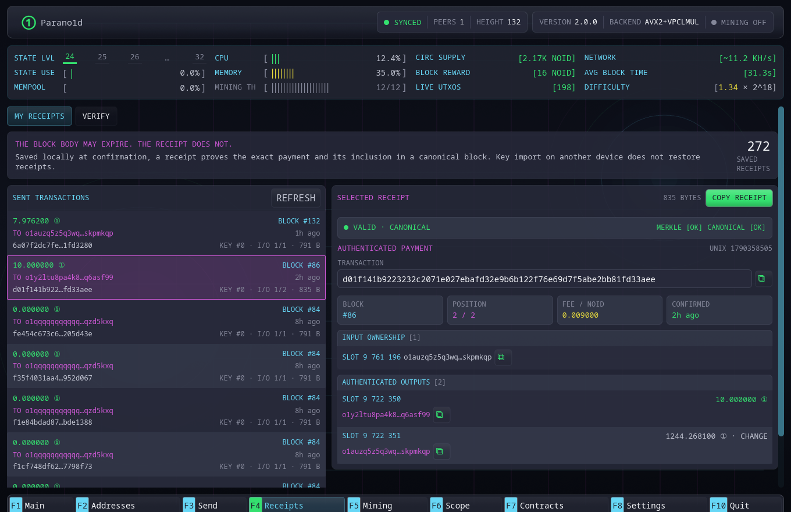

# Receipts

The Receipts section preserves and verifies durable proof of outgoing payments.
Open it with `F4`.

## My receipts

**My receipts** lists confirmed payments made from a wallet owner to a distinct
recipient. Newest entries appear first and the list is paginated.

Selecting an entry shows its authenticated summary:

- logical transaction ID;
- canonical block height and transaction position;
- input owner and input records;
- recipient and change outputs;
- amount and fee;
- inclusion and canonical verification status.

The receipt is saved only after confirmation while complete block data is
available.

## Local-only records

Receipts are stored in `wallet.receipts` on this device. Importing the master
secret on another computer restores addresses and live funds, but not receipt
history.

Back up the file or export individual receipt text if payment evidence matters.
Loss of receipts does not affect spendable balance.

The store appends checksummed changes and periodically compacts them with an
atomic snapshot instead of rewriting the entire collection on every change.
Exported receipt text is independent of this local storage format.
See [wallet artifact storage](../reference/files-and-ports.md#wallet-artifact-storage)
for format and integrity checks.

## Verify

The **Verify** tab accepts exported hexadecimal receipt text. Verification
checks the transaction data and fixed-depth inclusion path, then compares the
claimed transaction root with the permanent canonical header when a node is
available.

The result distinguishes:

- a structurally valid inclusion proof;
- a receipt bound to the current canonical chain;
- invalid or malformed data.

## What does not appear

Same-owner consolidation does not create a receipt because it is not evidence
of payment to another owner.

A send to an inactive address derived by the same master secret does create a
receipt. Consensus sees a distinct recipient owner and does not scan the
wallet's possible address set.

For the underlying proof format, see
[Receipts and pruned history](../concepts/receipts.md).

## Contract calls

F4 handles ordinary payment receipts, including deposits to a contract.
Call receipts and shared contract files open in **F7 Contracts → Open file**.
They include public terms and proof of a state transition. Import merges
verified evidence into the local contract journal while preserving existing
records. See [contract receipts and recovery](../contracts/receipts-and-recovery.md).
