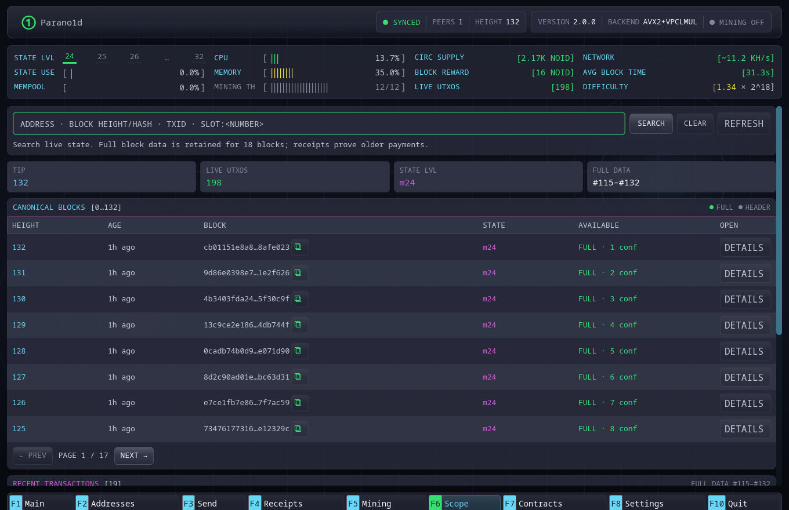

# Scope

Scope is the wallet's view into canonical headers, current Live State and the
recent full-data window. Open it with `F6`.

## Search

The search field accepts:

- a bech32m `o1…` address;
- a block height;
- a block hash;
- a logical transaction ID;
- `slot:<index>`.

Search operates against the local full node. It does not send the query to a
hosted explorer.

## Blocks

The canonical block table lists height, age, block ID, proof class and data
availability. **Full** means the body remains inside the 42-block retention
window. **Header** means the permanent header is available but the old body has
been pruned.

Block details include the canonical 212-byte header, system records and user
transactions while full data is retained.

## Recent transactions

The recent transaction table is drawn from retained complete blocks. Details
show physical pages, inputs, outputs, owners, fee and block position.

Old payments are not a permanent explorer database. Their canonical headers
remain, and a saved receipt provides the transaction-specific inclusion
evidence.

## Live State

An address query returns its current UTXOs. A slot query returns the current
record or canonical emptiness. Spent historical occupants are not reconstructed
outside the bounded undo window.

The State map on Main and Scope is a visualization of current occupancy, not a
history heatmap.
